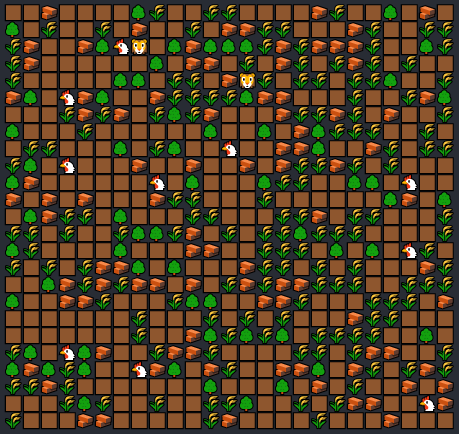

# Simulation Project
This is the second project in this [practical java course](https://zhukovsd.github.io/java-backend-learning-course/projects/simulation/#simulation).

## Rules
 - Only one entity can be on one coordinate at the time.
 - Grass, Rocks and Trees are static.
 - In one tick Creatures can do only one action (Move, Eat, Bite).
 - Herbivores move to nearest Grass and eat it, it's also restore their HP by 3.
 - Predators move to nearest Herbivores and bites them by reducing their HP by Attack Power.

## Main Features
 - OOP
 - Breadth-First Path Finding algorithm
 - Console renderer
 - FPS lock